<div align="center">

<!-- HEADER -->


<!-- TYPING ANIMATION -->
[](https://git.io/typing-svg)

</div>

---

<!-- ABOUT -->
### `> who am I?`

```cpp
struct Wren {
    String university  = "Bataan Peninsula State University";
    String degree      = "BS Computer Science (2025–2029)";
    String location     = "Philippines 🇵🇭";
    String interests[3]  = {"IoT", "Embedded Systems", "Software Development"};
    String currentlyWorkingOn = "Embedded systems roadmap: C++ → Arduino/ESP32 → connectivity";
    String motto        = "Not just how to build, but why things work.";
}
```

<!-- ACTIVITY GRAPH -->
<div>

### `> activity`

[](https://github.com/WDCT-Wren)

</div>

---

<!-- STREAK + CONTRIBUTIONS (self-hosted via GitHub Actions — see /.github/workflows/readme-stats.yml) -->
<div>

### `> streak`

<div align="center">
    <a href="https://git.io/streak-stats"></a>
</div>

### `> contributions`

<div align="center">
    
</div>

</div>

---

<!-- TECH STACK -->
### `> stack`

**Languages**


**Tools & Frameworks**


**Hardware & IoT**


---

<!-- PROJECTS -->
### `> projects`

<div align="center">

<a href="https://github.com/WDCT-Wren/EntroPass">
  <picture>
    <source media="(prefers-color-scheme: dark)" srcset="https://gh-card.dev/repos/WDCT-Wren/EntroPass.svg?theme=dark&fullname=">
    <source media="(prefers-color-scheme: light)" srcset="https://gh-card.dev/repos/WDCT-Wren/EntroPass.svg?fullname=">
    
  </picture>
</a>
<a href="https://github.com/WDCT-Wren/SeraphIV">
  <picture>
    <source media="(prefers-color-scheme: dark)" srcset="https://gh-card.dev/repos/WDCT-Wren/SeraphIV.svg?theme=dark&fullname=">
    <source media="(prefers-color-scheme: light)" srcset="https://gh-card.dev/repos/WDCT-Wren/SeraphIV.svg?fullname=">
    
  </picture>
</a>


</div>

---

<!-- CERTIFICATIONS -->
### `> certifications`

- 🏅 **IT Specialist — Java** · Pearson / Certiport · 2026
- 🏅 **IC3 Digital Literacy** · Certiport · 2025

---

<!-- CONNECT -->
### `> connect`

<div align="center">

[](https://linkedin.com/in/wren-daniel-tulio)
[](mailto:Wdctulio25@bpsu.edu.ph)

</div>

<!-- FOOTER -->

